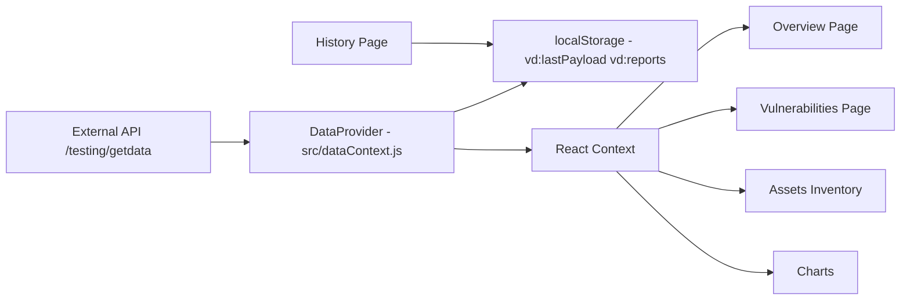
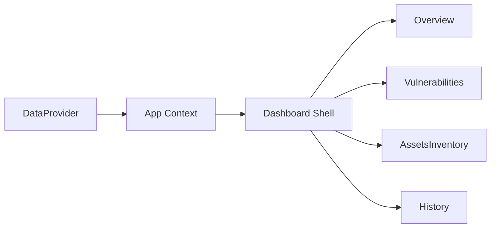
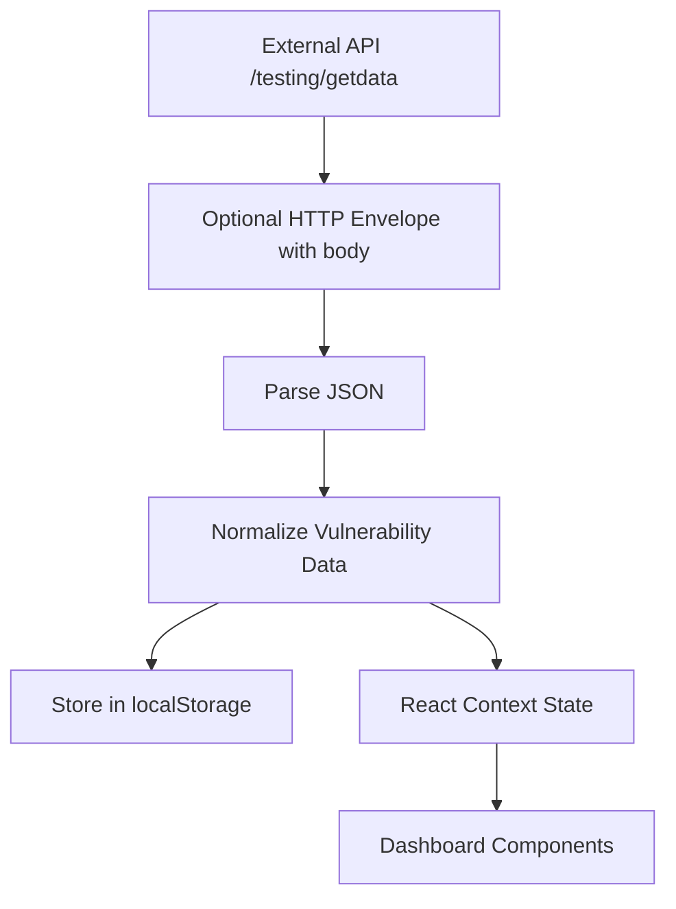
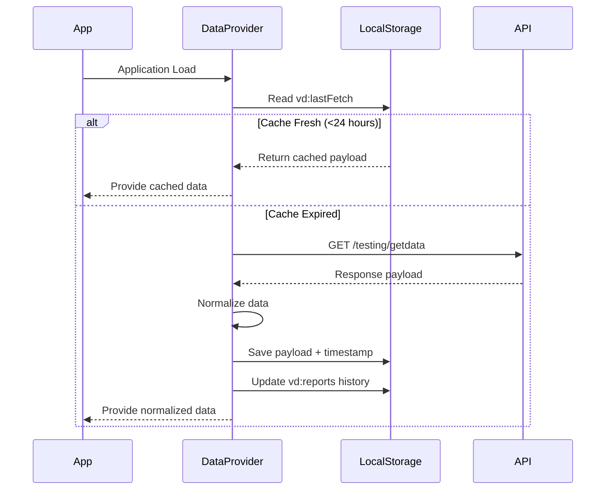

# Vulnerability Dashboard

A lightweight React-based dashboard for visualizing vulnerability scan data.
The application fetches vulnerability scan reports, normalizes them into a consistent structure, and provides interactive views for analyzing security findings, assets, and historical trends.

The dashboard is designed to operate **without requiring a backend server**, relying on browser storage and intelligent caching to manage report data efficiently.

---

# Features

* **24-hour API caching** to prevent repeated API calls
* **Automatic vulnerability data normalization**
* **Historical report tracking** stored in browser `localStorage`
* **Overview dashboard** with KPIs and vulnerability statistics
* **Severity distribution charts**
* **Searchable vulnerability findings**
* **Asset inventory view**
* **CSV export for findings**
* **Print-ready reports**
* **Responsive mobile layout**

---

# Quick Start

## Prerequisites

* Node.js **16+**
* npm

## Install dependencies

```bash
npm install
```

## Run the development server

```bash
npm start
```

The application will start locally and store report data in **browser localStorage**.

No backend server is required.

---

# Project Structure

```
src/
 ├── components/
 │   ├── Dashboard.js
 │   ├── Overview.js
 │   ├── Charts.js
 │   ├── Vulnerabilities.js
 │   ├── AssetsInventory.js
 │   └── History.js
 │
 ├── dataContext.js
 ├── index.css
 └── index.js

docs/
 └── screenshots/
     ├── overview-desktop.png
     ├── vulnerabilities-desktop.png
     ├── vulnerabilities-mobile.png
     ├── assets-inventory.png
     └── history-report.png
```

---

# Core Components

## `src/dataContext.js`

Responsible for:

* API data fetching
* 24-hour caching
* payload normalization
* report persistence
* managing application state via React Context

Local storage keys used:

| Key              | Purpose                    |
| ---------------- | -------------------------- |
| `vd:lastPayload` | latest normalized payload  |
| `vd:lastFetch`   | timestamp of last API call |
| `vd:reports`     | saved historical reports   |

---

## `Dashboard.js`

Defines the **application shell and navigation routes**.

---

## `Overview.js`

Displays:

* KPI cards
* severity distribution
* historical vulnerability statistics

---

## `Charts.js`

Visualization layer built with:

* **Chart.js**
* **react-chartjs-2**

Charts include:

* Severity pie chart
* CVSS distribution bar chart

---

## `Vulnerabilities.js`

Implements:

* searchable vulnerability table
* pagination
* CSV export
* modal vulnerability details
* mobile responsive cards

---

## `AssetsInventory.js`

Displays **host-based vulnerability data** grouped by asset.

---

## `History.js`

Displays historical scan reports stored in browser local storage.

---

# Architecture Overview



---

# Component Interaction

This diagram illustrates how React Context distributes data to the UI components.



---

# Data Flow

The dashboard processes incoming vulnerability scan reports before presenting them in the UI.



---

# Caching & Persistence Lifecycle



---

# Vulnerability Data Normalization

Incoming API responses may contain vulnerability data nested inside report objects.

The normalization layer converts the payload into two internal structures.

## Report Summary Object

```
{
  item_type: "report_summary",
  scan_start,
  report_id,
  total_high_severity_count
}
```

## Vulnerability Finding Object

```
{
  item_type: "finding",
  name,
  host,
  port,
  severity,
  severity_num,
  cvss,
  cves
}
```

Each item retains the original object inside a **`raw` field** for full traceability.

---

# Export & Reporting

The dashboard supports exporting vulnerability findings as **CSV files**.

Exports are generated entirely on the client side using the **Blob API**.

Printing support is implemented using the browser method:

```
window.print()
```

---

# Operational Considerations

* `localStorage` is used for persistence
* browser storage limits may restrict extremely large payloads
* historical reports are automatically pruned to:

  * **30 days retention**
  * **maximum 500 stored reports**

For multi-user deployments, a centralized backend database would be recommended.

---

# Screenshots

<p align="center">
<b>Overview Dashboard (Desktop)</b><br><br>

</p>

<br>

<p align="center">
<b>Vulnerabilities Table (Desktop)</b><br><br>

</p>

<br>

<p align="center">
<b>Vulnerabilities View (Mobile)</b><br><br>

</p>

<br>

<p align="center">
<b>Assets Inventory</b><br><br>

</p>

<br>

<p align="center">
<b>History – Saved Report Example</b><br><br>

</p>

---

# Future Improvements

Planned enhancements include:

1. Sparkline charts for historical trends
2. Advanced filtering in History view
3. Report comparison features
4. Backend storage integration
5. Unit testing for normalization logic
6. Continuous integration pipeline

---

# Technology Stack

* **React**
* **Chart.js**
* **react-chartjs-2**
* **JavaScript (ES6+)**
* **HTML / CSS**
* **Browser localStorage**

---

# License

This project is intended for **educational and demonstration purposes**.
