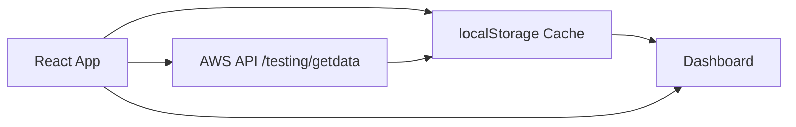
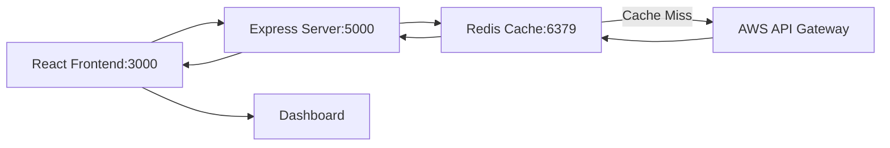
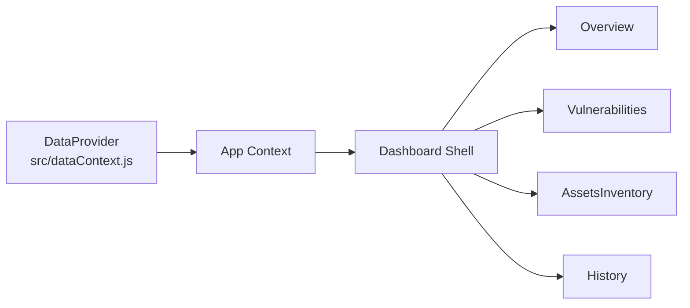
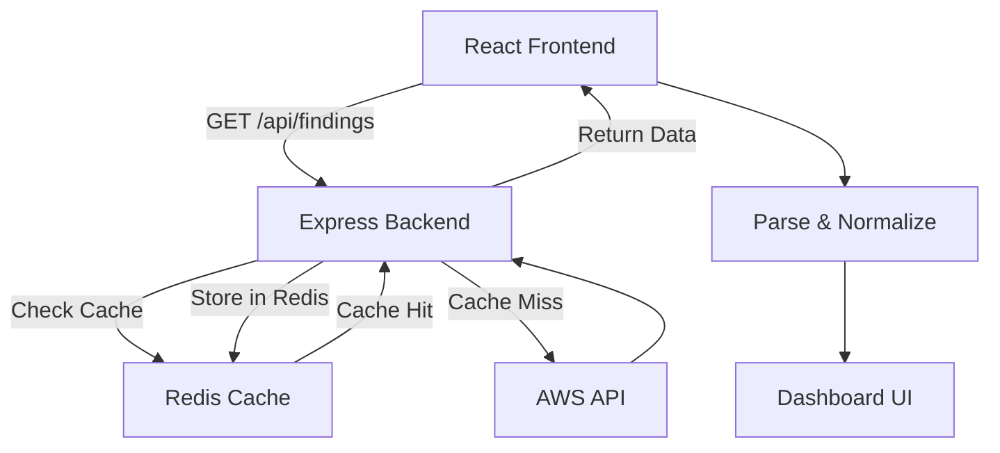
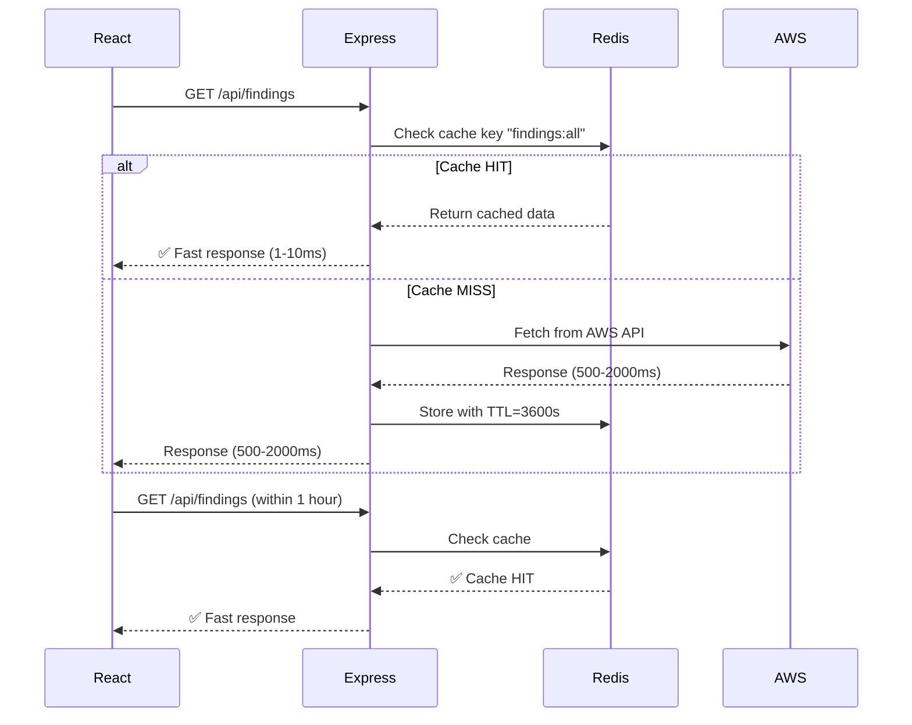

# Vulnerability Dashboard

A lightweight React-based dashboard for visualizing vulnerability scan data.
The application fetches vulnerability scan reports, normalizes them into a consistent structure, and provides interactive views for analyzing security findings, assets, and historical trends.

The dashboard can operate in **two modes**:
1. **Standalone Mode** — No backend, using browser `localStorage` for caching
2. **Redis-Backed Mode** — Express.js backend with Redis for enterprise-grade distributed caching

---

# Features

* **Redis-based distributed caching** (80-90% fewer AWS API calls)
* **24-hour local browser caching** as fallback
* **Automatic vulnerability data normalization**
* **Historical report tracking** stored in browser `localStorage`
* **Overview dashboard** with KPIs and vulnerability statistics
* **Severity distribution charts**
* **Searchable vulnerability findings**
* **Asset inventory view**
* **CSV export for findings**
* **Automated patching & scanning** integration
* **Graceful degradation** with demo data fallback
* **Print-ready reports**
* **Responsive mobile layout**

---

# Quick Start

## Prerequisites

* Node.js **16+**
* npm
* Docker & Docker Compose (for Redis mode)

## Standalone Mode (No Backend)

```bash
npm install
npm start
```

The application will start on `http://localhost:3000` and use browser `localStorage` for caching.

## Redis-Backed Mode (Recommended)

### 1. Start Redis

```bash
docker-compose up -d
```

### 2. Start the Express Backend

In a new terminal:

```bash
npm run server
```

The backend will run on `http://localhost:5000` with Redis caching enabled.

### 3. Start the React Frontend

In another terminal:

```bash
npm start
```

Or run both concurrently:

```bash
npm run start:dev
```

The dashboard will now use the backend API with Redis caching for significantly better performance.

### 4. Verify Setup

```bash
# Check backend health
curl http://localhost:5000/health

# Check cache stats
curl http://localhost:5000/cache/stats

# Clear cache if needed
curl -X POST http://localhost:5000/cache/clear
```

**→ See [docs/REDIS_CACHING.md](docs/REDIS_CACHING.md) for detailed Redis configuration.**

---

# Project Structure

```
src/
 ├── components/
 │   ├── Dashboard.js
 │   ├── Overview.js
 │   ├── Charts.js
 │   ├── Vulnerabilities.js
 │   ├── AssetsInventory.js
 │   └── History.js
 │
 ├── dataContext.js
 ├── index.css
 └── index.js

docs/
 └── screenshots/
     ├── overview-desktop.png
     ├── vulnerabilities-desktop.png
     ├── vulnerabilities-mobile.png
     ├── assets-inventory.png
     └── history-report.png
```

---

# Core Components

## `src/dataContext.js`

Responsible for:

* API data fetching
* 24-hour caching
* payload normalization
* report persistence
* managing application state via React Context

Local storage keys used:

| Key              | Purpose                    |
| ---------------- | -------------------------- |
| `vd:lastPayload` | latest normalized payload  |
| `vd:lastFetch`   | timestamp of last API call |
| `vd:reports`     | saved historical reports   |

---

## `Dashboard.js`

Defines the **application shell and navigation routes**.

---

## `Overview.js`

Displays:

* KPI cards
* severity distribution
* historical vulnerability statistics

---

## `Charts.js`

Visualization layer built with:

* **Chart.js**
* **react-chartjs-2**

Charts include:

* Severity pie chart
* CVSS distribution bar chart

---

## `Vulnerabilities.js`

Implements:

* searchable vulnerability table
* pagination
* CSV export
* modal vulnerability details
* mobile responsive cards

---

## `AssetsInventory.js`

Displays **host-based vulnerability data** grouped by asset.

---

## `History.js`

Displays historical scan reports stored in browser local storage.

---

# Architecture Overview

## Standalone Mode (Frontend Only)



## Redis-Backed Mode (Recommended)



---

# Component Interaction

This diagram illustrates how React Context distributes data to the UI components.



---

# Data Flow with Redis Caching

The dashboard processes incoming vulnerability scan reports and caches them via Redis for optimal performance.



---

# Caching Lifecycle with Redis



---

# Vulnerability Data Normalization

Incoming API responses may contain vulnerability data nested inside report objects.

The normalization layer converts the payload into two internal structures.

## Report Summary Object

```
{
  item_type: "report_summary",
  scan_start,
  report_id,
  total_high_severity_count
}
```

## Vulnerability Finding Object

```
{
  item_type: "finding",
  name,
  host,
  port,
  severity,
  severity_num,
  cvss,
  cves
}
```

Each item retains the original object inside a **`raw` field** for full traceability.

---

# Export & Reporting

The dashboard supports exporting vulnerability findings as **CSV files**.

Exports are generated entirely on the client side using the **Blob API**.

Printing support is implemented using the browser method:

```
window.print()
```

---

# Operational Considerations

* `localStorage` is used for persistence
* browser storage limits may restrict extremely large payloads
* historical reports are automatically pruned to:

  * **30 days retention**
  * **maximum 500 stored reports**

For multi-user deployments, a centralized backend database would be recommended.

---

# Screenshots

<p align="center">
<b>Overview Dashboard (Desktop)</b><br><br>

</p>

<br>

<p align="center">
<b>Vulnerabilities Table (Desktop)</b><br><br>

</p>

<br>

<p align="center">
<b>Vulnerabilities View (Mobile)</b><br><br>

</p>

<br>

<p align="center">
<b>Assets Inventory</b><br><br>

</p>

<br>

<p align="center">
<b>History – Saved Report Example</b><br><br>

</p>

---

# Backend Server (`server.js`)

With the addition of Redis caching, the dashboard now includes an Express.js backend server that:

* **Manages Redis cache** — Stores vulnerability findings, reports, and systems
* **Reduces AWS API calls** — 80-90% reduction by serving cached data on subsequent requests
* **Handles cache invalidation** — Clears cache when patching/scanning operations complete
* **Provides API endpoints** for frontend consumption

## Server Endpoints

| Method | Endpoint | Description |
|--------|----------|-------------|
| GET | `/api/findings` | Get vulnerability findings (cached) |
| GET | `/api/reports` | Get scan reports (cached) |
| GET | `/api/systems` | Get asset systems (cached) |
| POST | `/patching/apply` | Trigger patching, invalidate caches |
| POST | `/scanning/openvas-trigger` | Trigger scanning, invalidate caches |
| POST | `/cache/clear` | Manually clear all cache |
| GET | `/cache/stats` | View Redis memory statistics |
| GET | `/health` | Health check (Redis status) |

## Cache Configuration

Modify TTL (Time-To-Live) in `.env`:

```bash
CACHE_TTL_FINDINGS=3600    # 1 hour
CACHE_TTL_REPORTS=3600     # 1 hour
CACHE_TTL_SYSTEMS=1800     # 30 minutes
```

**→ See [docs/REDIS_CACHING.md](docs/REDIS_CACHING.md) for complete documentation.**

---

# Frontend Data Context (`src/dataContext.js`)

Updated to support Redis-backed caching:

* **Backend API calls** — Requests to `http://localhost:5000/api/*`
* **Automatic fallback** — Demo data on API errors
* **Cache invalidation** — Clears browser storage and Redis on patching/scanning
* **Local persistence** — Still maintains 30-day historical persistence

---

# Future Improvements

Planned enhancements include:

1. Sparkline charts for historical trends
2. Advanced filtering in History view
3. Report comparison features
4. Database persistence (PostgreSQL/MongoDB)
5. Unit testing for normalization logic
6. Continuous integration pipeline
7. Redis cluster support for horizontal scaling

---

# Technology Stack

* **Frontend:** React, Chart.js, react-chartjs-2, Axios
* **Backend:** Node.js, Express.js, Redis
* **Caching:** Redis (in-memory data structure store)
* **Infrastructure:** Docker, Docker Compose
* **Language:** JavaScript (ES6+)
* **Styling:** CSS3, Flexbox, Responsive design
* **API:** AWS Lambda with API Gateway

---

# License

This project is intended for **educational and demonstration purposes**.
