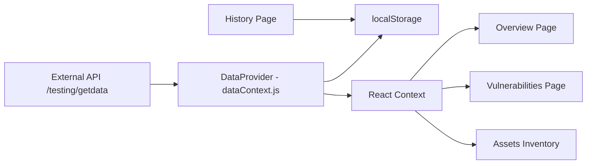
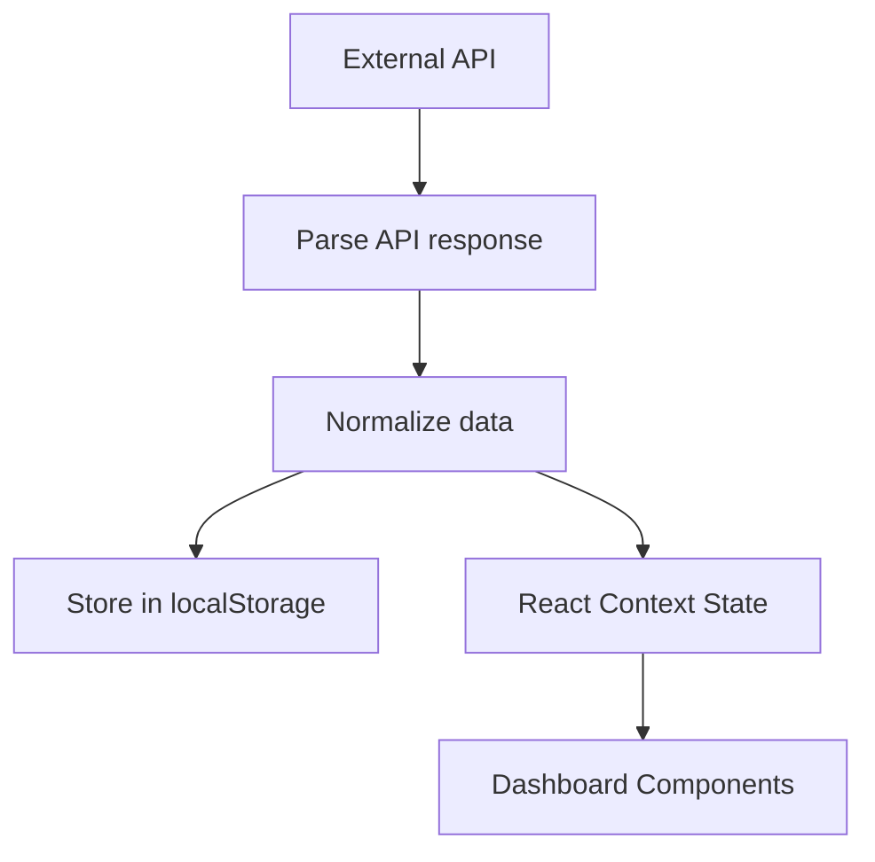

# Vulnerability Dashboard

A lightweight React-based dashboard for visualizing vulnerability scan data.
The application fetches security scan reports, normalizes them into a consistent format, and provides interactive views for analysis, reporting, and historical tracking.

The system is designed to operate **without requiring a backend server**, using browser-based storage and caching for persistence.

---

## Features

* 24-hour API caching to avoid unnecessary requests
* Automatic vulnerability data normalization
* Historical report tracking stored in browser localStorage
* Overview dashboard with KPIs and visual charts
* Searchable vulnerability findings
* Host / asset inventory view
* CSV export for vulnerability reports
* Print-friendly report generation
* Mobile responsive vulnerability views

---

## Quick Start

### Prerequisites

* Node.js **16+**
* npm

### Install dependencies

```bash
npm install
```

### Start the development server

```bash
npm start
```

The app will run locally and store data in the browser using **localStorage**.

No backend server is required.

---

## Project Structure

```
src/
 ├── components/
 │   ├── Dashboard.js
 │   ├── Overview.js
 │   ├── Charts.js
 │   ├── Vulnerabilities.js
 │   ├── AssetsInventory.js
 │   └── History.js
 │
 ├── dataContext.js
 ├── index.css
 └── index.js

docs/
 └── screenshots/
     ├── overview-desktop.png
     ├── vulnerabilities-desktop.png
     ├── vulnerabilities-mobile.png
     ├── assets-inventory.png
     └── history-report.png
```

---

## Core Components

### `src/dataContext.js`

Handles:

* API data fetching
* Caching logic
* Payload normalization
* localStorage persistence

### `Dashboard.js`

Defines the application shell and routing between views.

### `Overview.js`

Displays:

* KPI cards
* severity distribution
* historical vulnerability statistics

### `Charts.js`

Wrapper components built using:

* `chart.js`
* `react-chartjs-2`

### `Vulnerabilities.js`

Provides:

* searchable vulnerability table
* pagination
* CSV export
* modal details view
* responsive mobile layout

### `AssetsInventory.js`

Displays asset-level vulnerability data.

### `History.js`

Displays previously saved scan reports stored locally.

---

## Architecture Overview



---

## Data Flow



---

## Caching Mechanism

The application uses **browser localStorage** to avoid repeated API calls.

Stored keys:

| Key              | Purpose                                  |
| ---------------- | ---------------------------------------- |
| `vd:lastPayload` | Latest normalized payload                |
| `vd:lastFetch`   | Timestamp of last successful API request |
| `vd:reports`     | Historical reports list                  |

Cache policy:

* If data was fetched **within the last 24 hours**, the cached payload is used.
* Otherwise the application calls the API again.

---

## Vulnerability Data Normalization

Incoming API responses may contain vulnerability data nested inside a report structure.

The normalization layer converts the raw payload into two internal types:

### Report summary

```
{
  item_type: "report_summary",
  scan_start,
  report_id,
  total_high_severity_count
}
```

### Vulnerability finding

```
{
  item_type: "finding",
  name,
  host,
  port,
  severity,
  cvss,
  cves
}
```

This ensures UI components can render data consistently regardless of the API structure.

---

## Export and Reporting

The dashboard supports exporting vulnerability findings as **CSV files**.

Export is implemented entirely client-side using the **Blob API**.

Printing is supported using the browser’s built-in:

```
window.print()
```

---

## Operational Considerations

* localStorage has limited storage capacity
* very large payloads may exceed browser quota
* pruning keeps only **30 days of reports** and **maximum 500 items**

For multi-user environments, a backend database would be required.

---

## Screenshots

<p align="center">
<b>Overview Dashboard (Desktop)</b><br><br>

</p>

<br>

<p align="center">
<b>Vulnerabilities Table (Desktop)</b><br><br>

</p>

<br>

<p align="center">
<b>Vulnerabilities View (Mobile)</b><br><br>

</p>

<br>

<p align="center">
<b>Assets Inventory</b><br><br>

</p>

<br>

<p align="center">
<b>History – Saved Report Example</b><br><br>

</p>

---

## Future Improvements

Planned enhancements:

1. Sparkline charts for historical trends
2. History filtering by date range
3. Report comparison view
4. Server-backed report storage
5. Automated unit tests for data normalization
6. CI pipeline for build validation

---

## Tech Stack

* React
* Chart.js
* React ChartJS 2
* JavaScript (ES6+)
* HTML / CSS
* Browser localStorage

---

## License

This project is intended for **educational and demonstration purposes**.
