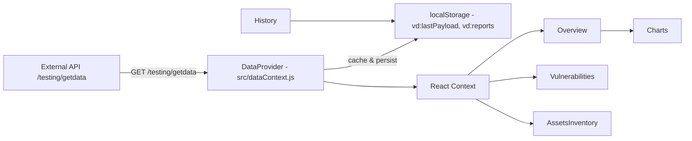
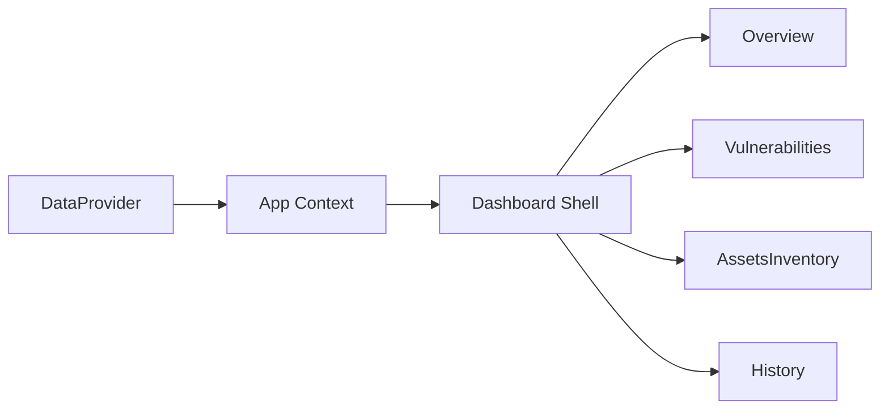
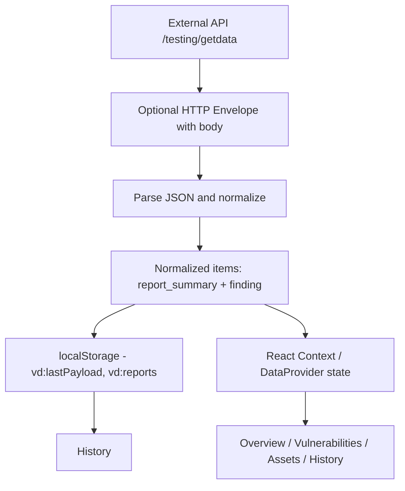
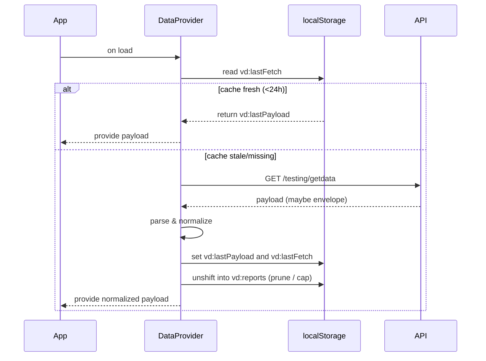

# Vulnerability Dashboard

This README documents the exact features implemented in this repository. It focuses on the code that is present in the workspace today. Use this as a developer-facing reference for running, extending, or handing off the dashboard.

---

**What this repo implements**
- Single daily API fetch with a 24-hour cache to avoid repeated API calls.
- Local history persisted in browser `localStorage` under the `vd:reports` key (30-day retention, 500-item cap).
- Overview and Vulnerabilities pages with KPIs, charts, searchable pageable findings, CSV export, and print support.
- A normalization layer in `src/dataContext.js` that adapts incoming API envelopes into the app's internal item format so UI components are unchanged.

**Quick start**
Prerequisites: Node 16+ and npm.

1. Install dependencies:

```bash
npm install
```

2. Start development server:

```bash
npm start
```

No server is required for the app to run — persistence and history are handled in-browser via `localStorage`.

**Core files to inspect**
- `src/dataContext.js` — fetch + cache + normalization + local persistence (`vd:lastPayload`, `vd:lastFetch`, `vd:reports`).
- `src/components/Dashboard.js` — app shell and route definitions.
- `src/components/Overview.js` — KPI cards, Charts integration, daily/weekly aggregates from `vd:reports`.
- `src/components/Charts.js` — `react-chartjs-2` wrappers used by Overview.
- `src/components/Vulnerabilities.js` — table, search, pagination, CSV export, modal and mobile card rendering.
- `src/components/AssetsInventory.js` — host inventory and per-host findings.
- `src/components/History.js` — reads `vd:reports` and displays persisted payloads.
- `src/index.css` — central stylesheet and responsive rules.

Architecture (runtime data flow)
--------------------------------
Mermaid diagram:



Data fetching, caching & persistence (precise behavior)
-----------------------------------------------------
- Cache keys used:
  - `vd:lastPayload` — JSON of the last successful payload used by the UI.
  - `vd:lastFetch` — timestamp (ms) when the last successful fetch occurred.
  - `vd:reports` — array of historical saved payloads: each entry `{ id, created_at, payload }`.
- Cache policy: when the app loads, `DataProvider` reads `vd:lastFetch`. If the timestamp is present and less than 24 hours old, the provider uses `vd:lastPayload` and **does not** call the API.
- Fetch path: when cache is stale or missing, `DataProvider` requests `/testing/getdata`. On success it:
  - normalizes the payload (see section below),
  - sets `vd:lastPayload` and `vd:lastFetch = Date.now()`,
  - unshifts `{ id, created_at, payload }` into `vd:reports`, pruning entries older than 30 days and truncating to 500 items.
  - attempts a best-effort non-blocking POST to `http://localhost:4000/api/reports` if a server is present (failures are ignored).

Normalization: incoming -> internal mapping
------------------------------------------
The app accepts the newer API envelope shape where the response can be an HTTP-style envelope with a `body` string containing JSON, and where each report object may hold a `vulnerabilities` array.

Implementation details in `src/dataContext.js`:
- If the top-level response contains a `body` string, the provider attempts `JSON.parse(body)`.
- If the parsed payload is an array of report objects, the provider transforms each report into:
  - One `report_summary` item: `{ item_type: 'report_summary', scan_start, report_id, total_high_severity_count, raw: <original_report> }`.
  - For each vulnerability in `report.vulnerabilities`, a `finding` item: `{ item_type: 'finding', name: vulnerability.vulnerability_name || vulnerability.name, host: vulnerability.host || vulnerability.hostname, port: vulnerability.port, severity: vulnerability.threat_level || vulnerability.severity, severity_num: Number(vulnerability.cvss_severity) || Number(vulnerability.severity_num) || 0, cvss: vulnerability.cvss_severity || vulnerability.severity_num, cves: vulnerability.nvt_oid ? [vulnerability.nvt_oid] : vulnerability.cves || [], raw: vulnerability }`.
- All normalized items retain an original `raw` field that contains the original object to preserve full fidelity.

Why normalization exists: it lets the existing UI (Overview, Vulnerabilities) continue to expect `report_summary` + `finding` items without modifying presentation code.

Overview aggregation (what's implemented)
----------------------------------------
- `Overview` reads `vd:reports` and computes daily counts (YYYY-MM-DD) and weekly counts (week-start). The page shows the last 7 days and last 8 weeks as textual lists of counts and uses `Charts.js` for severity/CVSS visuals.

Charts and visualization
-----------------------
- `react-chartjs-2` + `chart.js` are used. Implemented charts:
  - Severity pie: shows Critical / High / Medium / Low distribution.
  - CVSS bar: shows bucketed CVSS distribution.

Export & print
--------------
- CSV export for findings: client-side CSV generation using Blob; `Vulnerabilities` and `AssetsInventory` include export buttons.
- Print: `window.print()` invoked by the UI to render a print-friendly version.

Operational limits & tradeoffs (explicit)
---------------------------------------
- localStorage is the single source of historical persistence; if payloads are very large the browser quota may be reached despite pruning. Consider metadata-only persistence to reduce size.
- This app does not implement authentication or team-shared history. For multi-user history, add a secure backend.

Files intentionally not present / removed
--------------------------------------
- No production server dependency is required. A server scaffold exists in the repo for optional use, but running the app does not require it.
- No Redis, no centralized storage, and no authentication are implemented.
- No automated tests or CI configuration are included.

Developer next steps (prioritized)
----------------------------------
1. Replace textual daily/weekly aggregate lists with small sparklines (Chart.js) in `Overview` — small, high-ROI UI change.
2. Add History filters (date-range) and per-report JSON/CSV export.
3. Implement optional compressed/metadata-only history to reduce `localStorage` usage.
4. Add unit tests for `src/dataContext.js` normalization and `src/components/Overview.js` aggregation.

If you want, I can implement the first item (sparklines for daily/weekly aggregates) now — confirm and I will add the Chart.js sparklines into `Overview` and update the README with sample screenshot instructions.

---

**Diagrams (flowcharts you can render)**

Below are additional Mermaid diagrams you can render locally (VS Code Mermaid Preview or mermaid.live). They document component interactions, data flow from the external API to the store, and the caching/persistence lifecycle.

1) Component interaction (how Context provides data to views)



2) Data flow (API -> normalize -> localStorage -> UI)



3) Caching & persistence lifecycle



## Where to place screenshots in your report

Place all screenshots under the `docs/screenshots` directory and reference them from your report or README using relative links. The project already contains `docs/screenshots/README.md` with naming guidance.

Recommended section:

```markdown
## Screenshots

Overview (desktop):


Vulnerabilities (desktop table):


Vulnerabilities (mobile):


Assets inventory:


History (example saved report):

```
