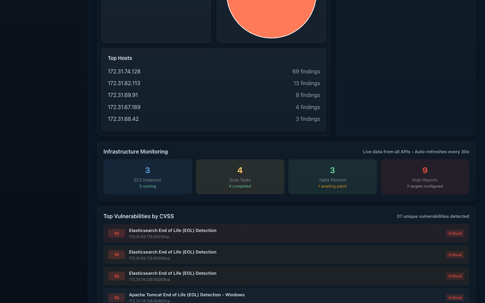
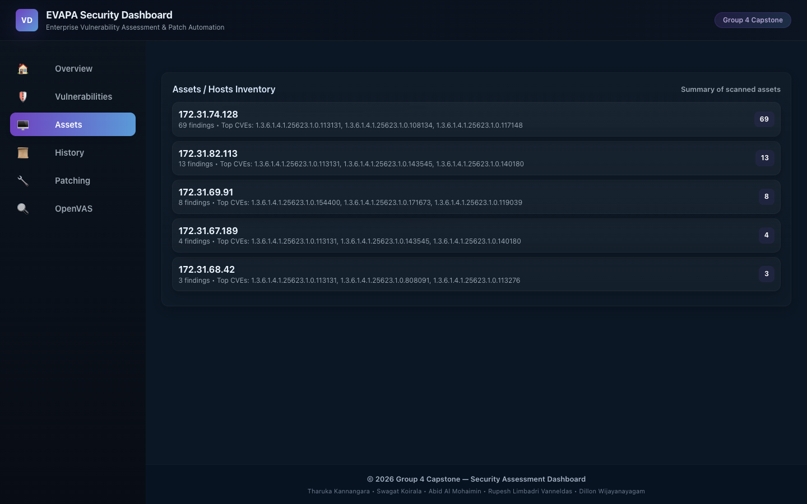
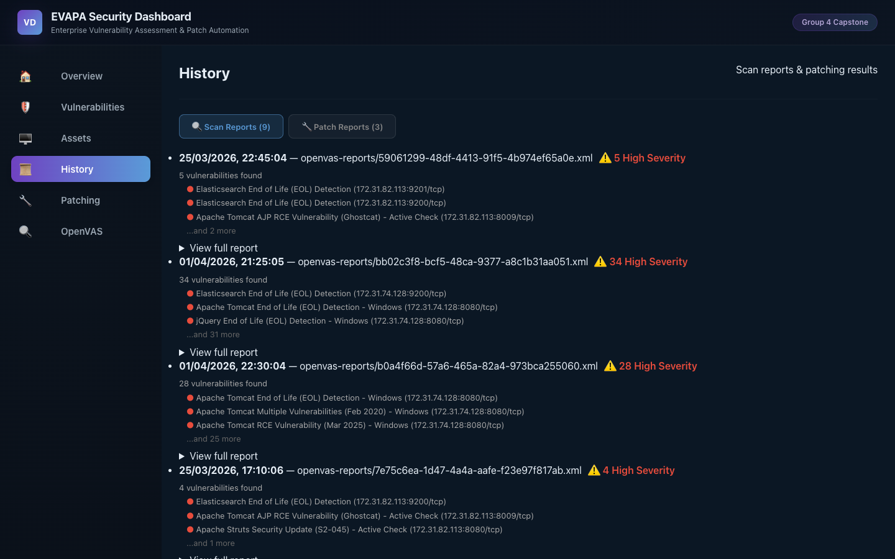
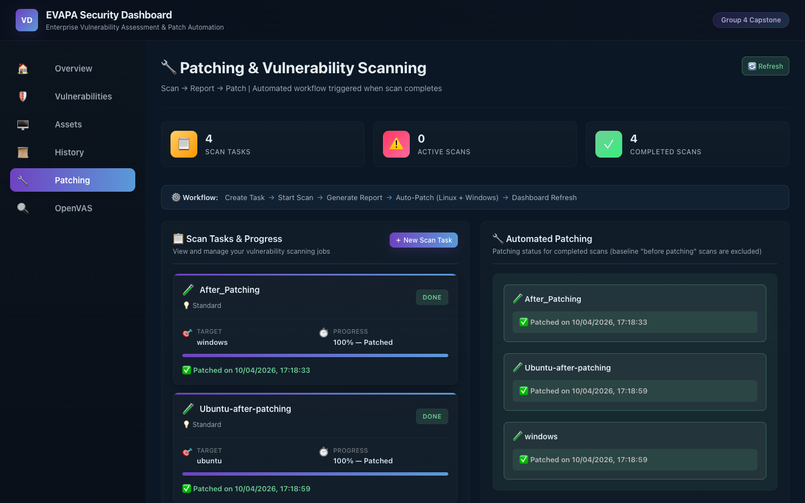
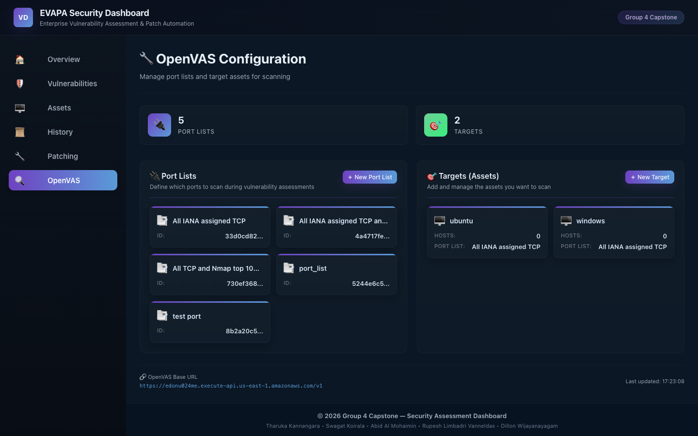
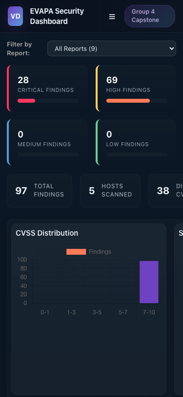

# EVAPA Security Dashboard

<p align="center">
  <strong>Enterprise Vulnerability Assessment, Patching & Automation Dashboard</strong>
</p>

<p align="center">
  
  
  
  
  
  
  
</p>

---

## Table of Contents

- [Overview](#overview)
- [Screenshots](#screenshots)
- [Key Features](#key-features)
- [Architecture](#architecture)
- [Technology Stack](#technology-stack)
- [Prerequisites](#prerequisites)
- [Installation & Setup](#installation--setup)
- [Running the Application](#running-the-application)
- [Using the Dashboard](#using-the-dashboard)
  - [Overview Tab](#1-overview-tab)
  - [Vulnerabilities Tab](#2-vulnerabilities-tab)
  - [Assets Tab](#3-assets-tab)
  - [History Tab](#4-history-tab)
  - [Patching Tab](#5-patching-tab)
  - [OpenVAS Config Tab](#6-openvas-config-tab)
- [Configuration](#configuration)
- [Project Structure](#project-structure)
- [Caching & Performance](#caching--performance)
- [Demo Mode](#demo-mode)
- [Deployment](#deployment)
- [Troubleshooting](#troubleshooting)
- [Documentation](#documentation)
- [Contributing](#contributing)
- [License](#license)

---

## Overview

**EVAPA** (Enterprise Vulnerability Assessment, Patching & Automation) is a full-stack security operations dashboard built with React and Express.js. It provides a centralized interface for:

- **Viewing and analyzing** vulnerability scan results from OpenVAS
- **Automating patching** across Linux and Windows systems via AWS SSM playbooks
- **Managing vulnerability scans** with full OpenVAS integration (targets, port lists, configs, tasks)
- **Tracking history** of all scan reports and patch reports over time
- **Monitoring infrastructure** including EC2 fleet status, scan progress, and patch completion

All data flows through an Express.js backend with **enterprise-grade Redis caching**, reducing upstream API calls by 80–90% and delivering sub-10ms response times for cached data.

**Group 4 Capstone** — Seneca Polytechnic
> **Tharuka Kannangara** · **Swagat Koirala** · **Abid Al Mohaimin** · **Rupesh Limbadri Vanneldas** · **Dillon Wijayanayagam**

---

## Screenshots

### Overview Dashboard
The main landing page showing KPI cards, CVSS distribution chart, severity breakdown pie chart, scan summary, and top affected hosts.


### Overview — Charts & Monitoring
Scrolling further reveals Top Hosts by finding count, Infrastructure Monitoring (EC2 instances, scan tasks, patches, reports), and Top Vulnerabilities ranked by CVSS score.



### Vulnerability Table
Searchable, filterable, and paginated table of all vulnerability findings with severity badges, CVSS scores, CVE references, and description.


### Asset Inventory
Host-based grouping of scanned assets. Click any host to see its detailed findings, severity breakdown, and top CVEs.



### History & Reports
Dual-tab archive of scan reports and patch reports. Each entry includes timestamps, report IDs, and expandable payload details.



### Patching & Automation
Automated patching workflow with scan task status, real-time progress bars, and detailed per-playbook results.



### OpenVAS Configuration
Manage OpenVAS scan infrastructure — port lists, targets, and EC2 instances — from a single configuration panel.



### Mobile Responsive View
The dashboard adapts to mobile screens with a card-based layout, collapsible sidebar, and touch-friendly controls.

| Overview (Mobile) | Vulnerabilities (Mobile) |
|---|---|
|  |  |

---

## Key Features

### Vulnerability Management
- Real-time severity breakdown with KPI cards (Critical, High, Medium, Low)
- Searchable and sortable vulnerability table with pagination (10 per page)
- Filter by severity tab (All / Critical / High / Medium / Low)
- Full-text search across vulnerability name, host, and CVE
- CVSS scoring and CVE tracking with clickable details
- Host-based asset inventory view with per-host vulnerability drill-down
- CSV export for offline analysis
- Print-ready full-page report rendering

### Automated Patching
- One-click Linux and Windows patching via AWS SSM playbooks
- Two-step async workflow: **start playbook → poll for completion** (15-second intervals)
- OS-aware patching — automatically determines Linux, Windows, or both based on target name
- Real-time progress bar with phased status updates:
  1. Generate report
  2. Start Linux patching
  3. Poll Linux status
  4. Start Windows patching
  5. Poll Windows status
  6. Mark complete
- Duplicate prevention via Redis-based locking (`patch-lock:` key, 5-minute TTL) and client-side ref tracking
- Patch results stored in Redis with **30-day retention**
- Detail modal popup showing per-playbook task results (OK / Changed / Failed / Skipped counts)

### OpenVAS Integration
- Full scan management UI: port lists, targets, scan configs, and tasks
- Create scan targets directly from running EC2 instances
- Start and monitor vulnerability scans with live progress tracking
- Conditional caching — running scan tasks bypass cache for real-time progress updates
- Auto-patching triggers automatically when scan task status reaches "Done"
- Baseline scan filtering — "before patching" scans excluded from auto-patch triggers

### Infrastructure Monitoring
- Live dashboard with **30-second auto-refresh**
- EC2 fleet status (running/stopped instances)
- Scan task progress monitoring
- Patch completion tracking
- Report timeline with daily and weekly aggregates
- Dashboard summary endpoint aggregating all data sources in parallel

### Caching & Performance
- Redis-backed distributed caching (80–90% fewer upstream API calls)
- Smart cache invalidation on patching and scanning events
- Configurable TTL per endpoint (60 seconds to 1 hour depending on data volatility)
- Graceful degradation with demo mode when APIs are unavailable
- Health check (`/health`) and cache statistics (`/cache/stats`) endpoints

### User Experience
- Dark-themed responsive design with mobile-friendly card layout
- Full-width branded header with "EVAPA Security Dashboard" and "Group 4 Capstone" badge
- Collapsible sidebar navigation with 6 tabs
- Mobile hamburger menu with overlay sidebar
- Modal popups for detailed report viewing with blurred backdrop
- Footer with group member credits

---

## Architecture

```
┌─────────────────────────────────────────────────┐
│           React Frontend (SPA)                  │
│    Dashboard · Patching · Scanning · Reports    │
└──────────────┬──────────────────────────────────┘
               │ HTTP / REST
               ▼
┌─────────────────────────────────────────────────┐
│       Express.js Backend (API Gateway)          │
│    Caching · Proxy · Patching · OpenVAS         │
└──────────────┬──────────────────────────────────┘
               │
     ┌─────────┼──────────┬──────────────┐
     ▼         ▼          ▼              ▼
┌────────┐ ┌────────┐ ┌──────────┐ ┌──────────┐
│ Redis  │ │AWS SSM │ │ OpenVAS  │ │ AWS API  │
│ Cache  │ │Patching│ │ Scanner  │ │ Gateway  │
└────────┘ └────────┘ └──────────┘ │(DynamoDB)│
                                   └──────────┘
```

### Data Flow

```
User clicks a tab
       │
       ▼
React Frontend ──HTTP GET/POST──▶ Express Backend
                                       │
                                       ▼
                                 ┌─ Redis Cache ─┐
                                 │  Key exists?   │
                                 └───────┬────────┘
                                    Yes / No
                                   ╱         ╲
                             Return            Fetch from
                             cached            upstream API
                             data              (AWS/OpenVAS)
                             (1-10ms)          (500-2000ms)
                                                    │
                                                    ▼
                                              Store in Redis
                                              with TTL
                                                    │
                                                    ▼
                                              Return to frontend
                                              with source indicator
```

### Component Hierarchy

```
App (index.js)
├── DataProvider (dataContext.js) ─── provides vulnerability data + demo mode
│   └── PatchingProvider ─── provides patch/scan operations
│       └── Dashboard.js (app shell, header, sidebar, footer)
│           ├── Overview.js ─── KPI cards, charts, scan summary, live monitoring
│           │   └── Charts.js ─── Bar chart (CVSS), Pie chart (severity), Top Hosts
│           ├── Vulnerabilities.js ─── Filterable table, search, export, detail modal
│           ├── AssetsInventory.js ─── Host grouping, per-host drill-down, CSV export
│           ├── History.js ─── Dual-tab: Scan Reports + Patch Reports, detail modal
│           ├── Patching.js ─── Auto-patch workflow, progress bar, task management
│           └── OpenVASConfig.js ─── Port lists, targets, EC2 instances, task creation
```

---

## Technology Stack

| Layer | Technology | Version | Purpose |
|-------|-----------|---------|---------|
| **Frontend** | React | 18.2.0 | UI framework and SPA |
| **Charts** | Chart.js + react-chartjs-2 | 4.4.0 / 5.2.0 | Bar, pie, and distribution charts |
| **HTTP Client** | Axios | 1.4.0 | API requests (frontend + backend) |
| **Backend** | Express.js | 4.18.2 | REST API, proxy, caching layer |
| **Runtime** | Node.js | 16.x+ | Server-side JavaScript |
| **Cache** | Redis (server) | 7-alpine | Distributed cache with persistence |
| **Cache Client** | redis (npm) | 4.6.5 | Node.js Redis client |
| **AWS SDK** | @aws-sdk/client-ec2 | ^3.1016.0 | EC2 instance listing |
| **Icons** | Font Awesome | 6.4.0 (CDN) | UI iconography |
| **Environment** | dotenv | 16.0.3 | Environment variable management |
| **Dev Server** | nodemon | 2.0.22 | Auto-restart on file changes |
| **Concurrency** | concurrently | 8.0.1 | Run backend + frontend together |
| **Container** | Docker Compose | 3.8 | Redis container orchestration |
| **Build** | Create React App (react-scripts) | 5.0.1 | Build tooling and dev server |

---

## Prerequisites

Before starting, ensure you have the following installed:

| Tool | Required Version | Check Command | Installation |
|------|-----------------|---------------|-------------|
| **Node.js** | 16.x or higher | `node --version` | [nodejs.org](https://nodejs.org/) |
| **npm** | 8.x or higher | `npm --version` | Comes with Node.js |
| **Docker Desktop** | Latest | `docker --version` | [docker.com](https://www.docker.com/products/docker-desktop/) |
| **Git** | Any recent | `git --version` | [git-scm.com](https://git-scm.com/) |

---

## Installation & Setup

### Step 1: Clone the Repository

```bash
git clone https://github.com/InfraCrawlers/EVAPA-Dashboard.git
cd Dashboard
```

### Step 2: Install Dependencies

```bash
npm install
```

This installs all frontend (React, Chart.js, Axios) and backend (Express, Redis, AWS SDK) dependencies.

### Step 3: Configure Environment Variables

```bash
cp .env.example .env
```

Open `.env` in your editor and fill in the required values:

```bash
# Server
PORT=3005                    # Must match frontend proxy (package.json)
NODE_ENV=development

# Redis
REDIS_HOST=localhost
REDIS_PORT=6379

# AWS API (required for live data)
AWS_API_ENDPOINT=<your-aws-api-gateway-url>
AWS_PATCHING_API=<your-patching-api-url>

# AWS Credentials (optional — for EC2 instance listing)
AWS_ACCESS_KEY_ID=<your-key>
AWS_SECRET_ACCESS_KEY=<your-secret>
AWS_REGION=us-east-1

# Cache TTLs (seconds) — defaults are fine for most setups
CACHE_TTL_FINDINGS=3600
CACHE_TTL_REPORTS=3600
CACHE_TTL_PATCHING=300
CACHE_TTL_OPENVAS=300
```

### Step 4: Start Redis Container

Redis is **required** for all environments (development and production).

```bash
docker compose up -d
```

Verify Redis is running:

```bash
docker compose ps
```

Expected output:
```
NAME              IMAGE          STATUS          PORTS
dashboard-redis   redis:7-alpine   Up (healthy)   0.0.0.0:6379->6379/tcp
```

---

## Running the Application

### Option A: Separate Terminals (Recommended for Development)

**Terminal 1 — Backend Server:**
```bash
PORT=3005 npm run server
```

Expected output:
```
Redis connected successfully
🚀 Dashboard API Server running on http://localhost:3005
```

**Terminal 2 — Frontend Dev Server:**
```bash
npm start
```

This opens `http://localhost:3000` in your browser automatically.

### Option B: Concurrent Mode (Single Terminal)

```bash
PORT=3005 npm run start:dev
```

This runs both backend and frontend simultaneously using `concurrently`.

### Option C: Production Mode

```bash
# Build the React frontend
npm run build

# Serve everything from Express
PORT=3005 npm run start:prod
```

In production mode, Express serves the built React app on port 3005. No separate frontend server is needed.

### Verify Everything is Working

**Step 1:** Open `http://localhost:3000` (or `http://localhost:3005` in production mode)

**Step 2:** Check backend health by visiting `http://localhost:3005/health` in your browser or:
```bash
curl http://localhost:3005/health
```

Expected response:
```json
{
  "status": "ok",
  "redis": "connected",
  "timestamp": "2026-04-10T12:00:00.000Z"
}
```

**Step 3:** If you see the dashboard with data — you're connected to live APIs. If you see a yellow "Demo Mode" banner — the backend is running but upstream APIs are not configured or unreachable (see [Demo Mode](#demo-mode)).

---

## Using the Dashboard

The dashboard has **6 main tabs** accessible from the left sidebar. Each tab provides a different view of your security data.

### 1. Overview Tab

> **Purpose:** At-a-glance security posture with KPIs, charts, and live monitoring.


**What you see:**

| Section | Description |
|---------|-------------|
| **Severity KPI Cards** | Four cards across the top showing counts of Critical, High, Medium, and Low findings. Color-coded with progress bars. Click any card to jump to the Vulnerabilities tab filtered by that severity. |
| **Summary Stats** | Total Findings, Hosts Scanned, Distinct CVEs, and Average Severity score |
| **CVSS Distribution** | Bar chart showing finding counts across 5 CVSS score buckets: 0–1, 1–3, 3–5, 5–7, 7–10 |
| **Severity Breakdown** | Pie chart showing the proportion of Low, Medium, High, and Critical findings |
| **Scan Summary** | Latest scan target, scan date, and report ID |
| **Top Hosts** | List of the top 5 most affected hosts with finding counts |
| **Historical Aggregates** | Daily (last 7 days) and Weekly (last 8 weeks) report timelines |
| **Infrastructure Monitoring** | Live grid showing EC2 instances, scan tasks, patches applied, and reports generated (auto-refreshes every 30s) |

**How to use:**
1. Navigate to the **Overview** tab (selected by default on load)
2. Review the KPI cards to understand your current security posture
3. Click a severity card (e.g., "High Findings") to jump to the Vulnerabilities tab filtered by that severity
4. Scroll down to see charts, scan summary, and historical aggregates
5. The infrastructure monitoring grid at the bottom updates automatically every 30 seconds

---

### 2. Vulnerabilities Tab

> **Purpose:** Detailed table of all vulnerability findings with search, filter, sort, and export capabilities.


**What you see:**

| Column | Description |
|--------|-------------|
| **Name** | The vulnerability name (e.g., "The rlogin service is running") |
| **Host** | The IP address or hostname of the affected system |
| **Severity** | Color-coded badge — Critical (red), High (orange), Medium (yellow), Low (green) |
| **CVSS** | Numeric CVSS score (0.0–10.0) |
| **CVEs** | Associated CVE identifiers |
| **Description** | Brief summary of the vulnerability |

**How to use:**

1. **Filter by severity:** Click the tabs at the top — **All**, **Critical**, **High**, **Medium**, **Low**
2. **Search:** Type in the search box to filter by vulnerability name, host, or CVE (e.g., search "rlogin" or "127.0.0.1")
3. **Sort:** Click any column header to sort ascending/descending
4. **Paginate:** Use the Prev/Next buttons at the bottom (10 results per page)
5. **View details:** Click any row to open a detailed modal popup with the full vulnerability information
6. **Export CSV:** Click the CSV export button to download all findings as a spreadsheet
7. **Print:** Use the print button for a printer-friendly full-page report

**Mobile view:** On smaller screens, the table transforms into a card-based layout:


Each vulnerability becomes a card showing the name, severity badge, CVSS score, and CVE references.

---

### 3. Assets Tab

> **Purpose:** View scanned hosts and their associated vulnerabilities grouped by asset.


**What you see:**

| Section | Description |
|---------|-------------|
| **Assets / Hosts Inventory** | List of all scanned hosts. Each row shows the hostname/IP, finding count, and top CVEs. A badge shows the total vulnerability count. |
| **Host Details** | When a host is selected, shows all vulnerabilities for that specific host with severity and CVE details. |

**How to use:**

1. Navigate to the **Assets** tab from the sidebar
2. View the list of all scanned hosts with their finding counts
3. Click any host (e.g., "127.0.0.1") to expand its details
4. The **Host Details** panel below shows every vulnerability found on that host, including severity and CVE references
5. Use the **CSV export** button to download the host inventory
6. Use the **Print** button for a printable report

---

### 4. History Tab

> **Purpose:** View archived scan reports and patch reports with expandable details.


**What you see:**

The History tab has **two sub-tabs:**

| Sub-Tab | Description |
|---------|-------------|
| **Scan Reports** | List of all historical scan reports with timestamps, report IDs, and finding counts. Each entry has a "View payload" expander to see the raw scan data. |
| **Patch Reports** | List of all completed patch operations with timestamps and Linux/Windows results. Each entry has a "View Details" button opening a modal popup. |

**How to use:**

1. Navigate to the **History** tab from the sidebar
2. By default, the **Scan Reports** sub-tab is shown
3. Each scan report entry shows:
   - Scan timestamp (e.g., "04/03/2026, 18:27:23")
   - Report ID
   - **"View payload"** — click to expand and see the full JSON scan data
4. Switch to the **Patch Reports** sub-tab to see patch history
5. Each patch report shows:
   - Task name and target
   - Completion timestamp
   - Linux and Windows status summary
   - **"View Details"** button — opens a modal popup with per-playbook task results:
     - OK / Changed / Failed / Skipped counts for each Ansible task
     - Separate panels for Linux and Windows (only shows OS panels with actual data)
6. Reports are retained in Redis for **30 days**

---

### 5. Patching Tab

> **Purpose:** Automated vulnerability patching for Linux and Windows systems via AWS SSM playbooks.


**What you see:**

| Section | Description |
|---------|-------------|
| **Stat Cards** | Quick counts of total tasks, targets, patches applied, and reports |
| **Scan Tasks** | List of OpenVAS scan tasks with their current status. Tasks marked "Done" are eligible for auto-patching. |
| **Automated Patching** | When a scan task completes, an auto-patch workflow begins showing a real-time progress bar |
| **Create Task** | Form to create a new scan task by selecting a target and scan configuration |
| **Patch Detail Modal** | Popup showing detailed patch results with per-task OK/Changed/Failed/Skipped counts |

**How the auto-patching workflow works:**

1. An OpenVAS scan completes (status = "Done")
2. The system automatically triggers the patching workflow (excludes "before patching" baseline scans)
3. **Phase 1 — Report Generation:** Generates and stores the scan report
4. **Phase 2 — Linux Patching:** Starts the Linux SSM playbook, then polls every 15 seconds until completion
5. **Phase 3 — Windows Patching:** Starts the Windows SSM playbook, then polls every 15 seconds until completion
6. **Phase 4 — Mark Complete:** Stores results in Redis and invalidates dashboard caches
7. A real-time progress bar shows which phase is active
8. Click **"View Results"** to see detailed patch output in a modal popup

**OS-aware patching:**
- If the target name contains "Linux" → only Linux patching runs
- If the target name contains "Windows" → only Windows patching runs
- Otherwise → both Linux and Windows patching run sequentially

**Duplicate prevention:**
- A Redis lock key (`patch-lock:{taskName}`) prevents multiple simultaneous patch operations on the same task (5-minute TTL)
- Client-side ref tracking prevents the UI from re-triggering during the same session

---

### 6. OpenVAS Config Tab

> **Purpose:** Manage OpenVAS scan infrastructure — port lists, targets, and scan tasks.


**What you see:**

| Section | Description |
|---------|-------------|
| **Stat Cards** | Counts of port lists, targets, and EC2 instances |
| **Port Lists** | Create and view port lists defining which ports to scan (e.g., "T:1-1024" for TCP ports 1–1024) |
| **Targets** | Create scan targets from EC2 instances. Select an instance, and the target is created with its private IP and the first available port list. |
| **EC2 Instances** | List of running/stopped EC2 instances pulled from your AWS account. Shows instance ID, state, type, and private IP. |

**How to use — Step by step:**

**Step 1: Create a Port List**
1. Navigate to the **OpenVAS Config** tab
2. In the "Port Lists" section, enter a name (e.g., "Common Ports")
3. Enter a port range (e.g., `T:1-1024` for TCP ports 1–1024, or `T:22,80,443,3306`)
4. Click **Create**
5. The new port list appears in the list below

**Step 2: Create a Target**
1. Scroll to the "Targets" section
2. Your EC2 instances are automatically listed (requires AWS credentials in `.env`)
3. Click an EC2 instance to select it
4. The target is created using the instance's private IP and the first available port list
5. Optionally specify a custom alive test method

**Step 3: Create and Run a Scan Task**
1. Go to the **Patching** tab → "Create Task" section
2. Select a target and scan configuration
3. Click **Create Task**
4. The task appears in the scan task list
5. Click **Start Scan** on the task card
6. Monitor progress — the task status updates in real-time (bypasses cache while running)
7. When the scan completes ("Done"), auto-patching begins automatically

**Note:** If AWS credentials are not configured, the EC2 instances section shows a guidance message explaining how to add credentials.

---

## Configuration

### Environment Variables

Create a `.env` file from the provided template:

```bash
cp .env.example .env
```

| Variable | Description | Default | Required |
|----------|-------------|---------|----------|
| `PORT` | Backend server port | `5000` | No (use `3005` to match frontend proxy) |
| `NODE_ENV` | Environment mode (`development` / `production`) | `development` | No |
| `REDIS_HOST` | Redis server hostname | `localhost` | No |
| `REDIS_PORT` | Redis server port | `6379` | No |
| `REDIS_PASSWORD` | Redis authentication password | — | No |
| `CACHE_TTL_FINDINGS` | Findings cache TTL in seconds | `3600` (1 hour) | No |
| `CACHE_TTL_REPORTS` | Reports cache TTL in seconds | `3600` (1 hour) | No |
| `CACHE_TTL_PATCHING` | Patching result cache TTL in seconds | `300` (5 min) | No |
| `CACHE_TTL_OPENVAS` | OpenVAS report cache TTL in seconds | `300` (5 min) | No |
| `AWS_API_ENDPOINT` | Vulnerability data API (DynamoDB via API Gateway) | — | **Yes** (for live data) |
| `AWS_PATCHING_API` | Patching service API endpoint | — | **Yes** (for patching) |
| `AWS_ACCESS_KEY_ID` | AWS credentials for EC2 instance listing | — | No (EC2 features disabled without it) |
| `AWS_SECRET_ACCESS_KEY` | AWS credentials for EC2 instance listing | — | No (EC2 features disabled without it) |
| `AWS_REGION` | AWS region for EC2 and SSM | `us-east-1` | No |

> **Important:** The server default port is `5000`, but the frontend proxy in `package.json` points to `http://localhost:3005`. Always run the server with `PORT=3005` during development to match.

### npm Scripts

| Command | Description |
|---------|-------------|
| `npm start` | Start React frontend dev server (port 3000, hot-reload) |
| `npm run server` | Start Express backend with nodemon (hot-reload on file changes) |
| `npm run start:dev` | Run backend + frontend concurrently in one terminal |
| `npm run start:prod` | Start Express in production mode (serves built React app) |
| `npm run build` | Build optimized React production bundle |
| `npm test` | Run Jest test suite |

---

## Project Structure

```
Dashboard/
├── src/
│   ├── components/
│   │   ├── Dashboard.js         # App shell — header, sidebar, footer, tab routing
│   │   ├── Overview.js          # KPI dashboard with live 30s auto-refresh monitoring
│   │   ├── Charts.js            # Chart.js wrappers — CVSS bar, severity pie, top hosts
│   │   ├── Vulnerabilities.js   # Filterable/searchable paginated findings table
│   │   ├── AssetsInventory.js   # Host-based asset grouping with drill-down
│   │   ├── DataTable.js         # Generic data table utility component
│   │   ├── History.js           # Dual-tab: scan reports + patch reports with modals
│   │   ├── Patching.js          # Auto-patch workflow with progress bar & OS detection
│   │   ├── OpenVASConfig.js     # Port list, target, and EC2 management UI
│   │   └── OpenVASConfig.css    # OpenVAS config component styles
│   ├── services/
│   │   └── openvasService.js    # OpenVAS API client (11 methods, 30s timeout)
│   ├── dataContext.js           # React Context — state, API layer, demo mode, refresh
│   ├── mockData.js              # 16 demo findings across 8 hosts for fallback mode
│   ├── index.js                 # React 18 entry point (createRoot API)
│   ├── index.css                # Global responsive styles (dark theme)
│   └── App.js                   # Root component — wraps DataProvider + PatchingProvider
│
├── server.js                    # Express backend — 30+ routes, Redis caching, API proxy
├── docker-compose.yml           # Redis 7 Alpine container with AOF persistence
├── package.json                 # Dependencies, scripts, and frontend proxy config
├── .env.example                 # Environment variable template
│
├── public/
│   └── index.html               # HTML entry — loads Font Awesome 6.4.0 from CDN
│
├── docs/
│   ├── SETUP_GUIDE.md           # Step-by-step installation guide
│   ├── REDIS_CACHING.md         # Cache architecture and configuration
│   ├── REDIS_IMPLEMENTATION.md  # Technical implementation details
│   ├── PATCHING_FEATURE.md      # Patching automation documentation
│   ├── PATCHING_API.md          # Patching endpoint reference
│   ├── DEMO_MODE.md             # Graceful degradation behavior
│   ├── CODEBASE_ANALYSIS.md     # Architecture deep-dive
│   ├── README_ORIGINAL.md       # Original detailed internal README
│   └── screenshots/             # UI screenshots used in this README
│
└── build/                       # Production build output (generated by npm run build)
```

---

## Caching & Performance

### How Caching Works

The Express backend uses a `CacheService` class that wraps the Redis client:

1. **On every GET request:** The backend checks Redis for a cached response using a deterministic key (e.g., `findings:all`, `openvas:tasks:all`)
2. **Cache hit:** Returns the cached JSON immediately (1–10ms response time)
3. **Cache miss:** Fetches from the upstream API, stores the result in Redis with a TTL, then returns it
4. **Invalidation:** Write operations (patching, scanning, creating resources) automatically invalidate related cache keys using glob patterns

### Cache TTL Reference

| Cache Key Pattern | TTL | Description |
|-------------------|-----|-------------|
| `findings:all` | 3600s (1 hour) | Vulnerability findings |
| `reports:all` | 3600s (1 hour) | Scan reports |
| `dashboard:summary` | 120s (2 min) | Aggregated dashboard data |
| `aws:ec2:instances:all` | 600s (10 min) | EC2 instance list |
| `openvas:port-lists:all` | 900s (15 min) | Port lists |
| `openvas:targets:all` | 900s (15 min) | Targets |
| `openvas:tasks:all` | 300s (5 min) | Scan tasks (skipped if tasks are running) |
| `openvas:task-progress:{name}` | 60s (1 min) | Individual task progress (skipped if running) |
| `patched:{taskName}` | 30 days | Completed patch results |
| `patch-lock:{taskName}` | 300s (5 min) | Duplicate patching prevention lock |
| `api:{endpoint}` | 3600s (1 hour) | Catch-all proxy cache |

### Performance Metrics

| Metric | Value |
|--------|-------|
| Cache hit response time | 1–10 ms |
| Cache miss response time | 500–2000 ms |
| Overall API call reduction | ~90% |
| Production React bundle | 130 kB (gzipped) |
| Steady-state cache hit rate | 95%+ |
| Dashboard summary refresh | Every 30 seconds |

---

## Demo Mode

When the backend API is unreachable or not configured, the dashboard automatically enters **Demo Mode**:

- A **yellow banner** appears at the top: "Demo Mode: Showing sample data"
- **16 realistic mock vulnerabilities** across 8 hosts are displayed
- All 4 severity levels are represented (Critical, High, Medium, Low)
- Charts, KPIs, tables, and asset groupings work with demo data
- No manual configuration needed — triggers automatically on API connection errors
- Disappears automatically when the backend API becomes reachable

Demo mode is useful for:
- Testing the UI without configuring AWS credentials
- Demonstrating dashboard features in presentations
- Development when offline

---

## Deployment

### Development (Local)

```bash
docker compose up -d          # Start Redis
PORT=3005 npm run server      # Start backend
npm start                     # Start frontend
```

### Production (Single Server)

```bash
docker compose up -d          # Start Redis
npm run build                 # Build React app
PORT=3005 npm run start:prod  # Express serves everything on port 3005
```

### Docker Build

```dockerfile
FROM node:16-alpine
WORKDIR /app
COPY package*.json ./
RUN npm ci --only=production
COPY . .
RUN npm run build
CMD ["npm", "run", "start:prod"]
```

```bash
docker build -t evapa-dashboard:latest .
docker run -p 3005:3005 -e REDIS_HOST=redis -e PORT=3005 evapa-dashboard:latest
```

### Docker Compose (Full Stack)

The included `docker-compose.yml` runs Redis with:
- **Image:** `redis:7-alpine`
- **Persistence:** AOF (append-only file) with named volume `redis-data`
- **Health check:** `redis-cli ping` every 5 seconds
- **Restart policy:** `unless-stopped`
- **Network:** Isolated `dashboard-network` (bridge driver)

```bash
docker compose up -d
```

### Cloud Deployment (AWS)

| Component | AWS Service | Notes |
|-----------|------------|-------|
| Frontend | CloudFront + S3 | Serve the `build/` folder as a static site |
| Backend | EC2 or ECS | Run the Express server |
| Cache | ElastiCache (Redis) | Managed Redis, set `REDIS_HOST` to the endpoint |
| Data | DynamoDB + API Gateway | Vulnerability data source |
| Patching | SSM + Lambda | Ansible playbook execution |

---

## Troubleshooting

<details>
<summary><strong>Redis connection failed</strong></summary>

**Symptoms:** Backend logs show "Redis connection error" or health check shows `"redis": "disconnected"`.

**Steps:**
1. Verify the Docker container is running:
   ```bash
   docker ps | grep redis
   ```
2. Check container health:
   ```bash
   docker compose ps
   ```
3. Restart Redis:
   ```bash
   docker compose down && docker compose up -d
   ```
4. Verify Redis is accepting connections:
   ```bash
   docker exec dashboard-redis redis-cli ping
   # Expected: PONG
   ```

**Note:** The app will still work without Redis — it falls back to in-memory operation but loses cache persistence.

</details>

<details>
<summary><strong>Backend won't start</strong></summary>

**Steps:**
1. Check if port 3005 is already in use:
   ```bash
   lsof -i :3005
   ```
2. Validate server.js syntax:
   ```bash
   node -c server.js
   ```
3. Check your `.env` file exists and is properly formatted
4. Ensure `npm install` completed successfully
5. Try starting with verbose output:
   ```bash
   PORT=3005 node server.js
   ```

</details>

<details>
<summary><strong>Dashboard shows "Demo Mode" banner</strong></summary>

**This means:** The frontend can reach the backend, but the backend cannot reach the upstream AWS API.

**Steps:**
1. Check your `.env` file has `AWS_API_ENDPOINT` set correctly
2. Verify the backend health:
   ```bash
   curl http://localhost:3005/health
   ```
3. Test the API connection from your terminal:
   ```bash
   curl http://localhost:3005/api/findings
   ```
4. If you see `"source": "demo"` in the response, your AWS API endpoint is unreachable

</details>

<details>
<summary><strong>EC2 instances not showing in OpenVAS Config</strong></summary>

**This means:** AWS credentials are not configured or are invalid.

**Steps:**
1. Ensure both `AWS_ACCESS_KEY_ID` and `AWS_SECRET_ACCESS_KEY` are set in `.env`
2. Verify the IAM user/role has `ec2:DescribeInstances` permissions
3. Check the correct `AWS_REGION` is set
4. Restart the backend after changing `.env`:
   ```bash
   PORT=3005 npm run server
   ```

</details>

<details>
<summary><strong>Patching appears stuck</strong></summary>

**Steps:**
1. Check if a Redis lock exists:
   ```bash
   docker exec dashboard-redis redis-cli keys "patch-lock:*"
   ```
2. If a stale lock exists, delete it:
   ```bash
   docker exec dashboard-redis redis-cli del "patch-lock:<taskName>"
   ```
3. Check backend logs for patching API errors
4. Verify the patching API endpoint in `.env` (`AWS_PATCHING_API`) is correct

</details>

<details>
<summary><strong>Cache showing stale data</strong></summary>

**Steps:**
1. Check cache statistics:
   ```bash
   curl http://localhost:3005/cache/stats
   ```
2. Manually clear all cached data:
   ```bash
   curl -X POST http://localhost:3005/cache/clear
   ```
3. Refresh the dashboard — fresh data will be fetched from upstream APIs

</details>

---

## Documentation

Detailed technical documentation is available in the [`docs/`](docs/) directory:

| Document | Size | Description |
|----------|------|-------------|
| [Setup Guide](docs/SETUP_GUIDE.md) | 8 KB | Complete step-by-step installation, Docker setup, and deployment instructions |
| [Redis Caching](docs/REDIS_CACHING.md) | 15 KB | Cache architecture, endpoint reference, performance optimization, and troubleshooting |
| [Redis Implementation](docs/REDIS_IMPLEMENTATION.md) | 6 KB | Technical implementation details — files modified, cache keys, deployment checklist |
| [Patching Feature](docs/PATCHING_FEATURE.md) | 4 KB | Automated patching workflow, VM selection logic, status tracking |
| [Patching API](docs/PATCHING_API.md) | — | Patching endpoint reference — Linux & Windows flows, start/poll/complete lifecycle |
| [Demo Mode](docs/DEMO_MODE.md) | 2 KB | Graceful degradation behavior, demo data structure, testing without API |
| [Codebase Analysis](docs/CODEBASE_ANALYSIS.md) | 8 KB | Architecture deep-dive, data flow diagrams, component relationships |
| [Original README](docs/README_ORIGINAL.md) | 25 KB | Full internal technical README with all API endpoint tables and implementation details |

---

## Contributing

1. **Fork** the repository
2. **Create** a feature branch:
   ```bash
   git checkout -b feature/my-feature
   ```
3. **Make** your changes and test locally
4. **Commit** with a descriptive message:
   ```bash
   git commit -m 'Add my feature'
   ```
5. **Push** to your branch:
   ```bash
   git push origin feature/my-feature
   ```
6. **Open** a Pull Request against the `prototype` branch

---

## License

This project is intended for **educational and demonstration purposes** as part of the Group 4 Capstone at Seneca Polytechnic.

---

<p align="center">
  <sub>Built with React · Express.js · Redis · Chart.js · OpenVAS · AWS</sub><br/>
  <sub>EVAPA Security Dashboard v2.1.0 — Group 4 Capstone 2026</sub>
</p>
