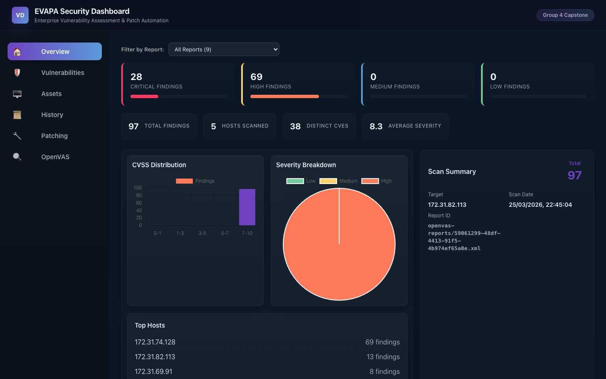
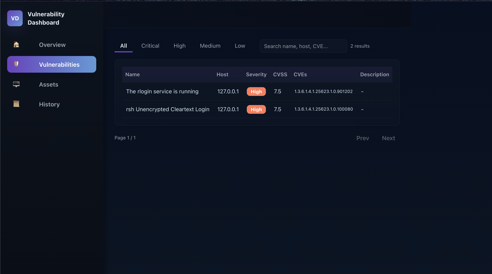
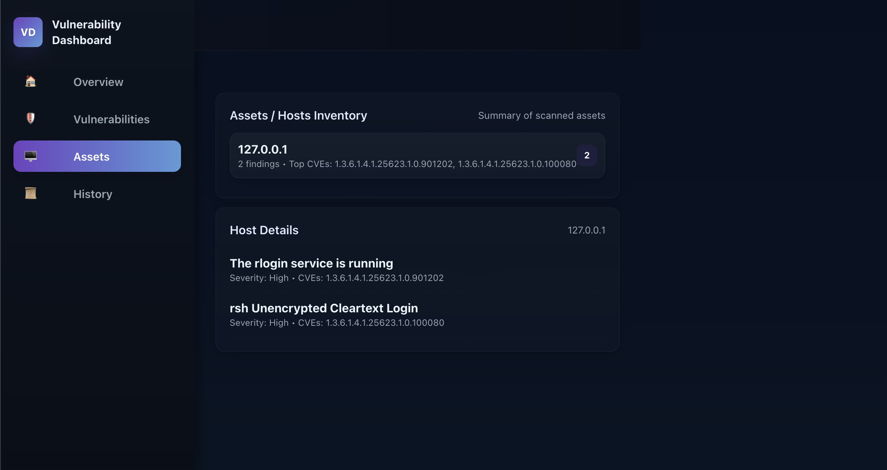
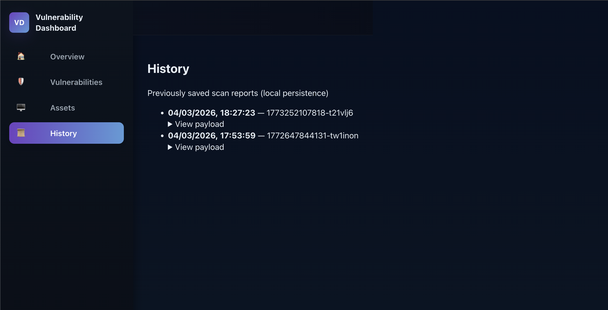
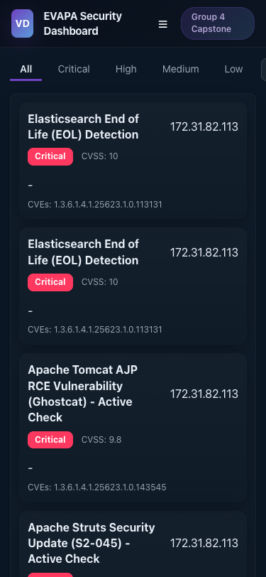

# EVAPA Security Dashboard

<p align="center">
  <strong>Enterprise Vulnerability Assessment, Patching & Automation Dashboard</strong>
</p>

<p align="center">
  
  
  
  
  
</p>

---

## Overview

**EVAPA** (Enterprise Vulnerability Assessment, Patching & Automation) is a full-stack security operations dashboard built with React and Express.js. It provides real-time vulnerability management, automated OS patching, and integrated vulnerability scanning — all backed by enterprise-grade Redis caching for high-performance data delivery.

Designed as a **Group 4 Capstone** project by:
> **Tharuka Kannangara** · **Swagat Koirala** · **Abid Al Mohaimin** · **Rupesh Limbadri Vanneldas** · **Dillon Wijayanayagam**

---

## Screenshots

| Overview Dashboard | Vulnerability Table |
|---|---|
|  |  |

| Asset Inventory | History & Reports |
|---|---|
|  |  |

<details>
<summary>📱 Mobile View</summary>



</details>

---

## Key Features

### Vulnerability Management
- Real-time severity breakdown with KPIs (Critical, High, Medium, Low)
- Searchable and sortable vulnerability table with pagination
- CVSS scoring and CVE tracking
- Host-based asset inventory view
- CSV export and print-ready reports

### Automated Patching
- One-click Linux and Windows patching via AWS SSM playbooks
- Two-step async workflow: start playbook → poll for completion
- Real-time progress bar with step-by-step status updates
- Patch results stored with 30-day retention
- Dual-tab history view for scan and patch reports

### OpenVAS Integration
- Full scan management UI: targets, port lists, scan configs, tasks
- Start and monitor vulnerability scans
- View detailed scan reports

### Performance & Reliability
- Redis-backed distributed caching (80–90% fewer API calls)
- Smart cache invalidation on patching and scanning events
- Configurable TTL per endpoint (1800–3600 seconds)
- Graceful degradation with demo mode when APIs are unavailable
- Health check endpoints for monitoring

### User Experience
- Responsive design with mobile-friendly card layout
- Full-width branded header and footer
- Six navigable tabs: Overview, Vulnerabilities, Assets, History, Patching, OpenVAS Config
- Modal popups for detailed report viewing

---

## Architecture

```
┌─────────────────────────────────────────────────┐
│           React Frontend (SPA)                  │
│    Dashboard · Patching · Scanning · Reports    │
└──────────────┬──────────────────────────────────┘
               │ HTTP / REST
               ▼
┌─────────────────────────────────────────────────┐
│       Express.js Backend (API Gateway)          │
│    Caching · Proxy · Patching · OpenVAS         │
└──────────────┬──────────────────────────────────┘
               │
        ┌──────┼──────────┐
        ▼      ▼          ▼
   ┌────────┐ ┌────────┐ ┌──────────────┐
   │ Redis  │ │Patching│ │  OpenVAS     │
   │ Cache  │ │Service │ │  Scanner     │
   └────────┘ └────────┘ └──────────────┘
```

**Data Flow:**
1. Frontend sends request to Express backend
2. Backend checks Redis cache (1–10ms hit)
3. On cache miss, fetches from upstream API (500–2000ms)
4. Stores result in Redis with configurable TTL
5. Returns data to frontend with source indicator (`cache` or `api`)

---

## Technology Stack

| Layer | Technology | Purpose |
|-------|-----------|---------|
| **Frontend** | React 18.2, Chart.js 4.4, Axios | SPA dashboard with data visualizations |
| **Backend** | Node.js 16+, Express.js 4.18 | REST API, proxy, and caching layer |
| **Cache** | Redis 7 (Docker Alpine) | Distributed caching with TTL |
| **Patching** | AWS Systems Manager (SSM) | Linux & Windows automated patching |
| **Scanning** | OpenVAS (via API) | Vulnerability scanning engine |
| **Infrastructure** | Docker, Docker Compose | Container orchestration |

---

## Getting Started

### Prerequisites

- **Node.js** 16.x or higher
- **npm** 8.x or higher
- **Docker Desktop** (required for Redis)

### Installation

```bash
# Clone the repository
git clone https://github.com/InfraCrawlers/EVAPA-Dashboard.git
cd Dashboard

# Install dependencies
npm install

# Configure environment
cp .env.example .env
# Edit .env with your API endpoints and credentials
```

### Running the Application

```bash
# 1. Start Redis
docker compose up -d

# 2. Start Backend (in a separate terminal)
PORT=3005 npm run server

# 3. Start Frontend (in a separate terminal)
npm start
```

The dashboard opens at `http://localhost:3000`.

**Or run everything concurrently:**
```bash
docker compose up -d
npm run start:dev
```

### Production Build

```bash
npm run build
PORT=3005 npm run start:prod
```

---

## Configuration

Create a `.env` file from the provided template:

```bash
cp .env.example .env
```

| Variable | Description | Default |
|----------|-------------|---------|
| `PORT` | Backend server port | `3005` |
| `NODE_ENV` | Environment mode | `development` |
| `REDIS_HOST` | Redis hostname | `localhost` |
| `REDIS_PORT` | Redis port | `6379` |
| `REDIS_PASSWORD` | Redis password (if auth enabled) | — |
| `CACHE_TTL_FINDINGS` | Findings cache TTL (seconds) | `3600` |
| `CACHE_TTL_REPORTS` | Reports cache TTL (seconds) | `3600` |
| `AWS_API_ENDPOINT` | Upstream vulnerability data API | — |
| `AWS_REGION` | AWS region for SSM patching | `us-east-1` |

> **Note:** Refer to `.env.example` for the full list of configurable variables.

---

## Project Structure

```
Dashboard/
├── src/
│   ├── components/
│   │   ├── Dashboard.js         # App shell, navigation, layout
│   │   ├── Overview.js          # KPI dashboard with charts
│   │   ├── Charts.js            # Chart.js visualizations
│   │   ├── Vulnerabilities.js   # Findings table with search
│   │   ├── AssetsInventory.js   # Host-based grouping
│   │   ├── History.js           # Scan + patch report archive
│   │   ├── Patching.js          # Automated patching workflow
│   │   └── OpenVASConfig.js     # Scan management UI
│   ├── services/
│   │   └── openvasService.js    # OpenVAS API client
│   ├── dataContext.js           # State management & API layer
│   ├── mockData.js              # Demo mode fallback data
│   └── App.js                   # Root component
├── server.js                    # Express backend
├── docker-compose.yml           # Redis container config
├── docs/                        # Extended documentation
└── build/                       # Production build output
```

---

## Performance

| Metric | Value |
|--------|-------|
| Cache hit response | 1–10 ms |
| Cache miss response | 500–2000 ms |
| API call reduction | ~90% |
| Production bundle | 130 kB (gzipped) |
| Cache hit rate (steady state) | 95%+ |

---

## Deployment

### Docker

```bash
docker build -t evapa-dashboard:latest .
docker run -p 3005:3005 -e REDIS_HOST=redis evapa-dashboard:latest
```

### Docker Compose (Full Stack)

```bash
docker compose up -d
```

### Cloud (AWS)

| Component | Service |
|-----------|---------|
| Frontend | CloudFront + S3 |
| Backend | EC2 / ECS |
| Cache | ElastiCache (Redis) |

---

## Documentation

Detailed documentation is available in the [`docs/`](docs/) directory:

| Document | Description |
|----------|-------------|
| [Setup Guide](docs/SETUP_GUIDE.md) | Step-by-step installation and deployment |
| [Redis Caching](docs/REDIS_CACHING.md) | Cache architecture and configuration |
| [Redis Implementation](docs/REDIS_IMPLEMENTATION.md) | Technical implementation details |
| [Patching Feature](docs/PATCHING_FEATURE.md) | Automated patching workflow |
| [Patching API](docs/PATCHING_API.md) | Patching endpoint reference |
| [Demo Mode](docs/DEMO_MODE.md) | Graceful degradation behavior |
| [Codebase Analysis](docs/CODEBASE_ANALYSIS.md) | Architecture deep-dive |

---

## Troubleshooting

<details>
<summary><strong>Redis connection failed</strong></summary>

```bash
docker ps | grep redis          # Verify container is running
docker compose down && docker compose up -d   # Restart Redis
```
</details>

<details>
<summary><strong>Backend won't start</strong></summary>

```bash
lsof -i :3005     # Check if port is already in use
node -c server.js  # Validate syntax
```
</details>

<details>
<summary><strong>Dashboard shows demo data</strong></summary>

- A yellow banner indicates demo mode is active
- Verify your `.env` file has the correct API endpoint configured
- Ensure the backend server is running and reachable
</details>

---

## Contributing

1. Fork the repository
2. Create a feature branch (`git checkout -b feature/my-feature`)
3. Commit your changes (`git commit -m 'Add my feature'`)
4. Push to the branch (`git push origin feature/my-feature`)
5. Open a Pull Request

---

## License

This project is intended for **educational and demonstration purposes** as part of the Group 4 Capstone at Seneca Polytechnic.

---

<p align="center">
  <sub>Built with React, Express.js, Redis, and OpenVAS</sub>
</p>

---

## 🤝 Contributing

To contribute:

1. Fork the repository
2. Create feature branch (`git checkout -b feature/amazing-feature`)
3. Commit changes (`git commit -m 'feat: add amazing feature'`)
4. Push to branch (`git push origin feature/amazing-feature`)
5. Open Pull Request to `prototype` branch

---

## 📧 Support & Questions

- **Setup Issues:** See [docs/SETUP_GUIDE.md](docs/SETUP_GUIDE.md)
- **Redis Questions:** See [docs/REDIS_CACHING.md](docs/REDIS_CACHING.md)
- **Patching Issues:** See [docs/PATCHING_FEATURE.md](docs/PATCHING_FEATURE.md)
- **Architecture:** See [docs/CODEBASE_ANALYSIS.md](docs/CODEBASE_ANALYSIS.md)

---

## 🎉 Quick Links

| Resource | Link |
|----------|------|
| **Live Demo** | http://localhost:3000 (after npm start) |
| **API Docs** | http://localhost:3005/health |
| **Redis Guide** | [docs/REDIS_CACHING.md](docs/REDIS_CACHING.md) |
| **Setup Instructions** | [docs/SETUP_GUIDE.md](docs/SETUP_GUIDE.md) |
| **GitHub** | https://github.com/InfraCrawlers/EVAPA-Dashboard |

---

**Built with ❤️ by Group 4 Capstone — Tharuka Kannangara, Swagat Koirala, Abid Al Mohaimin, Rupesh Limbadri Vanneldas, Dillon Wijayanayagam | 2026**

**Dashboard Version 2.1 | Production Ready | Enterprise Grade**
